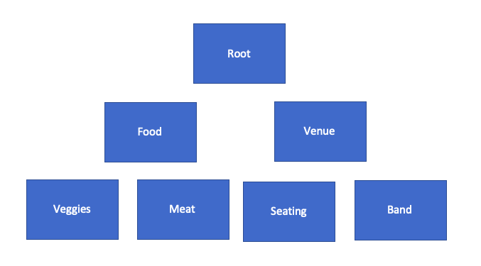

# Trees
## Introduction
A very basic definition of a tree is a data structure that has parent and children relationships. It can also be seen as root and leaf (hence the tree). The root node cannot have any parent nodes. Similarly a leaf node cannot have any children nodes. We are going to learn about the Binary Search Tree or the BST. This tree is set up so any Children node can only have one Parent. Any Parent can only have 1 or 2 children(hence the binary). To try and bring Tacos into this data structure I will start by declaring myself the Root. In this example nodes will represent responsibilities. As the root I can only have two children nodes. One will be getting a Venue, the other will be getting the food. My responsibility of getting a venue will be split to two responsibilities. Getting a band and getting seating. The food responsibility will be split into prepping vegtables and prepping meat. 



Another important thing to remember aoubt the BST. It needs to be balanced. That means you cant have one side of the tree two nodes longer than another. In our example we could add cooking chicken under meat but we could not add anything under the chicken untill we add to the veggies, seating, and band. 
## Different Trees
We are not going to go over other different trees but it is important to note that their are different types of trees, like the red black tree or the Binary Tree.  
## Recursion
Recursion is a topic in itself. Although recursion is not a data structure it is very important when it comes to the tree. Recursion can be a tricky thing to understand. The idea of recursion is to call a function within a function. Without setting some rules this can get very sticky, very fast. Without simplifying the problem we would get a loop that would last until something crashes. Because of this we have two rules with recursion. 
1. We must establish a base case to tell us when to stop calling our function.
2. We must simplify the problem

```
def count(number):
    print(number)
    if(number <= 0 ):
        pass
    else:
    count(number - 1)
```
This simple example shows a base case (if statement). And a simplified problem (number - 1) while calling itself as the count function.

We will show how recursion fits in the tree in the next couple of sections. 
## Add to Tree
To start, we need to know if the data is already in the tree. If it is how are we going to deal with it? For our work today we will take out any repeats. Feel free to expirament with the tree to allow repeats.
```
if data == node.data:            
    pass
```
If the data does not equal the data in the node we are looking at then we need to see if we need to look down the left side of the tree or the right. 
```
elif data < node.data:

...

else:
```
Once we determine which side of the tree we need to look at we will need to see if we have an empty spot to enter our data.
```
if node.left is None:
```
or
```
if node.right is None:
```
In this case we would add our data
```
node.left = BST.Node(data)
```
or 
```
node.right = BST.Node(data)
```
If we dont have an empty spot then we will want to start the process all over again. This is where recursion comes into play. We need to do the same logic but while looking at a different node. Looking at a different node is making our problem smaller so we can avoid an infinite loop. 
```
self._insert(data, node.left)
```
or
```
self._insert(data, node.right)
```

## Remove from Tree
Removing from the tree will follow very similar logic. In the practice problem you will write a function that will search a tree to see if your data already exists in the tree. This could be modified to remove from the tree. 
## Efficiency
The efficiency of the BST is determined by what you are trying to do. When you are adding, taking away, or seeing if the tree contains a value the Efficiency will be O(log<sub>n</sub>). This is because when you look at a node you will only look at one of its children. Every time you ues recursion in this BST you are making the problem smaller by %50. 

On the other hand traversing through the tree can be expensive. If you want to see every piece of data you will have to look through every piece, resulting in 0(n) efficiency. 
## Example
In this example we are adding to a BST and it is being sorted through the tree according to the length of the string. 

[Example](tree-ex.py)
## Practice problem
Unlike the example for the practice problem you will be sorting through the tree by the value of the int. 

[Practice Problem](tree-problem.py)
## link to solution

[Practice Solution](tree-solution.py)

Back to the [welcome page](welcome.md).